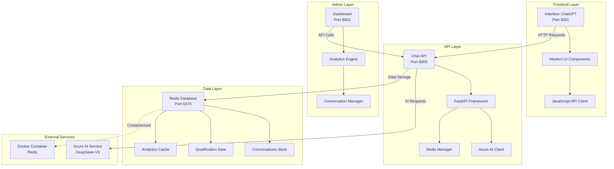

# 🏗️ Arquitetura do Sistema - Scoras Academy Agent

## 📊 Visão Geral da Arquitetura



## 🔧 Componentes Principais

### 1. **Frontend Interface (Port 3001)**

#### 📱 Tecnologias
- **HTML5**: Estrutura semântica moderna
- **CSS3**: Design responsivo com CSS Variables
- **JavaScript ES6+**: Lógica interativa e comunicação API
- **Font Awesome**: Ícones modernos
- **Inter Font**: Tipografia profissional

#### 🎨 Características
- **Design ChatGPT-style**: Interface moderna e intuitiva
- **Responsivo**: Funciona em desktop, tablet e mobile
- **Animações**: Transições suaves e indicadores visuais
- **Real-time**: Status de conexão e typing indicators
- **Acessibilidade**: Suporte a screen readers e navegação por teclado

#### 📁 Estrutura de Arquivos
```
frontend/
├── index.html          # Página principal
├── style.css           # Estilos modernos
├── script.js           # Lógica do cliente
└── server.py           # Servidor de desenvolvimento
```

### 2. **Chat API (Port 8003)**

#### ⚙️ Tecnologias
- **FastAPI**: Framework Python moderno e rápido
- **Azure AI Inference**: Cliente oficial Azure
- **Redis-py**: Cliente Redis para Python
- **Uvicorn**: Servidor ASGI de alta performance
- **Pydantic**: Validação de dados e serialização

#### 🤖 Funcionalidades
- **Chat Inteligente**: Processamento via Azure AI (DeepSeek-V3)
- **Qualificação de Leads**: Detecção automática de dados de contato
- **Persistência**: Armazenamento completo no Redis
- **Health Monitoring**: Endpoints de monitoramento
- **Rate Limiting**: Controle de tráfego

#### 📋 Endpoints Principais
```python
GET  /health           # Status do sistema
POST /chat-simple      # Endpoint principal de chat
GET  /conversations    # Lista conversas
POST /reset-conversation # Reset de conversa específica
```

### 3. **Admin Dashboard (Port 8002)**

#### 📊 Tecnologias
- **FastAPI**: Backend para dashboard
- **HTML/CSS/JS**: Interface administrativa
- **Chart.js**: Gráficos e visualizações (futuro)
- **Redis Analytics**: Métricas em tempo real

#### 📈 Funcionalidades
- **Analytics em Tempo Real**: Estatísticas de conversas
- **Gestão de Leads**: Visualização de leads qualificados
- **Histórico Completo**: Navegação por conversas
- **Auto-refresh**: Atualização automática
- **Filtros Avançados**: Busca e filtragem de dados

### 4. **Redis Database (Port 6379)**

#### 🗄️ Estrutura de Dados
```redis
# Conversas
conversation:{user_id}
{
  "user_id": "string",
  "created_at": "ISO datetime",
  "lead_type": "academy",
  "messages": [
    {
      "timestamp": "ISO datetime",
      "user_message": "string",
      "bot_response": "string"
    }
  ]
}

# Qualificação
qualification:{user_id}
{
  "nome": "string|null",
  "email": "string|null", 
  "telefone": "string|null",
  "interesse": "string|null",
  "lead_type": "academy",
  "qualified": boolean,
  "last_interaction": "ISO datetime"
}
```

## 🔄 Fluxo de Dados

### 1. **Fluxo de Conversa**
```
1. User Input → Frontend
2. Frontend → Chat API (POST /chat-simple)
3. Chat API → Azure AI Service
4. Azure AI → Response
5. Chat API → Redis Storage
6. Chat API → Frontend Response
7. Frontend → UI Update
```

### 2. **Fluxo de Analytics**
```
1. Dashboard → Chat API (GET /admin/analytics)
2. Chat API → Redis Query
3. Redis → Aggregated Data
4. Chat API → Dashboard Response
5. Dashboard → UI Update
```

## 🚀 Processo de Inicialização

### Ordem de Startup
1. **Redis Container**: `docker run redis:alpine`
2. **Chat API**: `python chat_api_with_redis.py`
3. **Admin Dashboard**: `python admin_dashboard/admin_dashboard.py`
4. **Frontend Server**: `python frontend/server.py --port 3001`

### Script Automatizado
```bash
./start_all.sh  # Inicia todos os serviços
./stop_all.sh   # Para todos os serviços
```

## 🔐 Segurança e Performance

### Medidas de Segurança
- **CORS Policy**: Headers configurados adequadamente
- **Input Validation**: Sanitização de dados de entrada
- **Rate Limiting**: Controle de requisições por IP
- **Error Handling**: Logs estruturados sem exposição de dados
- **Environment Variables**: Credenciais via .env

### Otimizações de Performance
- **Connection Pooling**: Reutilização de conexões Redis
- **Async Processing**: FastAPI com async/await
- **Response Caching**: Cache de analytics no Redis
- **Lazy Loading**: Carregamento sob demanda no frontend
- **Compression**: Gzip para responses grandes

## 📊 Monitoramento e Logs

### Sistema de Logs
```
logs/
├── chat_api.log         # Logs da API principal
├── admin_dashboard.log  # Logs do dashboard
└── frontend.log         # Logs do servidor frontend
```

### Métricas Coletadas
- **Conversas por dia**: Total de novas conversas
- **Taxa de qualificação**: Percentual de leads qualificados
- **Tempo de resposta**: Latência média da API
- **Status de serviços**: Health checks automáticos
- **Uso de recursos**: CPU, memória, Redis

## 🧪 Ambiente de Desenvolvimento

### Dependências
```python
# requirements.txt
fastapi>=0.104.0
uvicorn>=0.24.0
redis>=5.0.0
azure-ai-inference>=1.0.0
python-dotenv>=1.0.0
```

### Variáveis de Ambiente
```bash
# .env
AZURE_AI_ENDPOINT=your_endpoint
AZURE_AI_API_KEY=your_key
AZURE_AI_MODEL=DeepSeek-V3-0324
REDIS_HOST=localhost
REDIS_PORT=6379
REDIS_PASSWORD=your_password
```

## 🚢 Deploy e Infraestrutura

### Containerização
```dockerfile
# Dockerfile (futuro)
FROM python:3.10-slim
COPY requirements.txt .
RUN pip install -r requirements.txt
COPY . .
EXPOSE 3001 8002 8003
CMD ["python", "start_all.py"]
```

### Docker Compose
```yaml
# docker-compose.yml
version: '3.8'
services:
  redis:
    image: redis:alpine
    ports: ["6379:6379"]
    
  academy-agent:
    build: .
    ports: 
      - "3001:3001"
      - "8002:8002" 
      - "8003:8003"
    depends_on: [redis]
```

## 🔮 Evolução Futura

### Próximas Funcionalidades
- **WebSocket Support**: Chat em tempo real
- **Microservices**: Separação em serviços independentes
- **API Gateway**: Roteamento centralizado
- **Load Balancer**: Distribuição de carga
- **Monitoring Stack**: Prometheus + Grafana

### Escalabilidade
- **Horizontal Scaling**: Múltiplas instâncias da API
- **Redis Cluster**: Distribuição de dados
- **CDN Integration**: Cache estático
- **Auto-scaling**: Kubernetes deployment

---

<div align="center">

**🎓 Arquitetura Scoras Academy Agent v2.1.0**

*Projetado para performance, escalabilidade e manutenibilidade*

</div> 