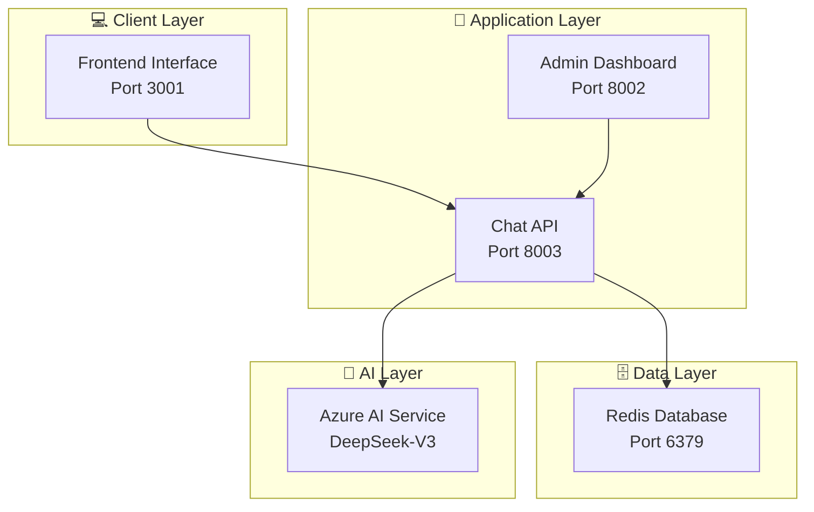

<div align="center">

# 🎓 Scoras Academy Agent

**Sistema de Chatbot Inteligente Especializado em Engenharia de IA**

[](https://scoras.com.br)
[](https://www.python.org/downloads/)
[](https://fastapi.tiangolo.com)
[](https://redis.io)
[](https://azure.microsoft.com/ai)


*Transformando vidas através da Engenharia de IA*

[🚀 Início Rápido](#-início-rápido) • [📖 Documentação](#-documentação) • [🏗️ Arquitetura](#️-arquitetura) • [🤝 Contribuir](#-contribuição)

</div>

---

## 🌟 Visão Geral

O **Scoras Academy Agent** é um assistente conversacional avançado focado exclusivamente nos cursos e programas da **Scoras Academy**. Desenvolvido com interface moderna estilo ChatGPT e integração completa com Redis para armazenamento de conversas.

### ✨ Principais Características

🎨 **Interface Moderna ChatGPT** - Design responsivo com tipografia Inter e animações suaves  
🤖 **IA Especializada** - Azure AI (DeepSeek-V3) treinada exclusivamente para Academy  
🗄️ **Storage Persistente** - Redis para armazenamento completo de conversas  
📊 **Dashboard Administrativo** - Analytics em tempo real e gestão de leads  
🚀 **Performance** - Arquitetura assíncrona de alta performance  
🔐 **Segurança** - Rate limiting, validação de dados e headers de segurança  

## 🚀 Início Rápido

### ⚡ Instalação Express (5 minutos)

```bash
# 1. Clone e entre no diretório
git clone https://github.com/scorastecnologialtda/scoras_academy_agent.git
cd scoras_academy_agent

# 2. Configure o ambiente
cp .env.example .env
# Edite .env com suas credenciais Azure AI

# 3. Inicie tudo com um comando
chmod +x start_all.sh
./start_all.sh
```

### 🌐 Acesse as Interfaces

| Serviço | URL | Descrição |
|---------|-----|-----------|
| 🤖 **Chat Interface** | http://localhost:3001 | Interface principal moderna |
| 📊 **Admin Dashboard** | http://localhost:8002/admin | Painel administrativo |
| ⚙️ **API Documentation** | http://localhost:8003/docs | Documentação da API |

## 🏗️ Arquitetura



### 🎯 Tecnologias Principais

- **Frontend**: HTML5, CSS3, JavaScript ES6+, Inter Font
- **Backend**: FastAPI, Python 3.10+, Uvicorn ASGI
- **AI**: Azure AI Inference, DeepSeek-V3 Model
- **Database**: Redis 5.0+ (conversations & analytics)
- **Infrastructure**: Docker, Linux containers

## 📖 Documentação

### 📚 Guias Principais

| Documento | Descrição |
|-----------|-----------|
| [🏗️ ARCHITECTURE.md](docs/ARCHITECTURE.md) | Documentação detalhada da arquitetura |
| [📝 CHANGELOG.md](docs/CHANGELOG.md) | Histórico de versões e mudanças |
| [🚀 QUICK_START.md](docs/QUICK_START.md) | Guia de início rápido |

### 🔧 Configuração

#### Arquivo .env
```bash
# Azure AI (OBRIGATÓRIO)
AZURE_AI_ENDPOINT=https://your-resource.openai.azure.com/
AZURE_AI_API_KEY=your-secret-key
AZURE_AI_MODEL=DeepSeek-V3-0324

# Redis
REDIS_HOST=localhost
REDIS_PORT=6379
```

#### Dependências
```bash
pip install fastapi uvicorn redis azure-ai-inference python-dotenv
```

## 🧪 Desenvolvimento

### 🛠️ Comandos Úteis

```bash
# Desenvolvimento
./start_all.sh          # Inicia todos os serviços
./stop_all.sh           # Para todos os serviços

# Debug individual
python chat_api_with_redis.py              # API Port 8003
python admin_dashboard/admin_dashboard.py  # Dashboard Port 8002
cd frontend && python server.py --port 3001  # Frontend Port 3001

# Logs
tail -f logs/chat_api.log
tail -f logs/admin_dashboard.log
```

### 🧪 Testes

```bash
# Health Check
curl http://localhost:8003/health

# Teste de Chat
curl -X POST http://localhost:8003/chat-simple \
  -H "Content-Type: application/json" \
  -d '{"message": "Quais cursos vocês têm?", "user_id": "test_user"}'

# Redis Status
docker exec -it scoras-redis redis-cli ping
```

## 📊 Features

### 🤖 Chat Inteligente
- **Processamento IA**: Azure AI com modelo DeepSeek-V3
- **Contexto Academy**: Especializado em cursos de Engenharia de IA
- **Qualificação Automática**: Detecção de leads qualificados
- **Memória Persistente**: Histórico completo no Redis

### 🎨 Interface Moderna
- **Design ChatGPT**: Interface moderna e intuitiva
- **Responsivo**: Funciona perfeitamente em mobile
- **Animações**: Indicadores de digitação e transições suaves
- **Acessibilidade**: Suporte completo a screen readers

### 📈 Dashboard Analytics
- **Métricas em Tempo Real**: Conversas, leads, taxa de qualificação
- **Gestão de Leads**: Visualização de leads qualificados
- **Histórico Completo**: Navegação por todas as conversas
- **Auto-refresh**: Atualização automática a cada 30 segundos

### 🔐 Segurança & Performance
- **Rate Limiting**: Controle de requisições por IP
- **Input Validation**: Sanitização completa de dados
- **CORS Policy**: Headers de segurança configurados
- **Async Processing**: Performance otimizada com FastAPI

## 📱 Sistema de Chat

### Fluxo de Conversa
1. **User Input** → Frontend Interface
2. **API Request** → Chat API (POST /chat-simple)
3. **AI Processing** → Azure AI Service
4. **Data Storage** → Redis Database
5. **Response** → Frontend com resposta formatada

### Qualificação de Leads
- **Detecção Automática**: Nome, email, telefone
- **Contexto Inteligente**: Interesse nos cursos
- **Status Tracking**: Leads qualificados vs não qualificados
- **Analytics**: Métricas de conversão em tempo real

## 🚀 Deploy

### 🐳 Docker (Recomendado)
```bash
# Redis Container
docker run -d --name scoras-redis -p 6379:6379 redis:alpine

# Build da aplicação (futuro)
docker build -t scoras-academy-agent .
docker run -p 3001:3001 -p 8002:8002 -p 8003:8003 scoras-academy-agent
```

### 🔧 Manual
```bash
# 1. Instalar dependências
pip install -r requirements.txt

# 2. Configurar ambiente
cp .env.example .env
# Editar .env

# 3. Iniciar Redis
docker run -d --name scoras-redis -p 6379:6379 redis:alpine

# 4. Iniciar serviços
./start_all.sh
```

## 🤝 Contribuição

### 🔄 Workflow
1. **Fork** do repositório
2. **Branch** para feature: `git checkout -b feature/nova-funcionalidade`
3. **Commit** das mudanças: `git commit -m 'feat: adiciona nova funcionalidade'`
4. **Push** para branch: `git push origin feature/nova-funcionalidade`
5. **Pull Request** para review

### 📋 Código de Conduta
- Use **conventional commits** (feat, fix, docs, style, refactor, test, chore)
- **Teste** localmente antes do commit
- **Documente** mudanças significativas
- **Mantenha** compatibilidade com a versão atual

## 📞 Suporte

### 🆘 Issues & Bugs
- **GitHub Issues**: Para reportar bugs ou solicitar features
- **Discussions**: Para perguntas e discussões gerais

### 📧 Contato Direto
- **Site**: [scorasacademy.com.br](https://scorasacademy.com.br)
- **LinkedIn**: [Scoras Academy](https://linkedin.com/company/scoras)
- **Email**: academy@scoras.com.br

## 📈 Roadmap

### v2.2.0 (Próxima)
- [ ] **WebSocket Support** - Chat em tempo real
- [ ] **Analytics Avançados** - Métricas detalhadas
- [ ] **Exportação de Dados** - Relatórios PDF/Excel
- [ ] **API Pública** - Endpoints para integração

### v2.3.0 (Futuro)
- [ ] **Modo Escuro** - Toggle para tema escuro
- [ ] **Multi-idiomas** - Suporte inglês/espanhol
- [ ] **Notificações** - Alertas para leads qualificados
- [ ] **Backup Automático** - Sistema de backup Redis

## 📄 Licença

Este projeto é desenvolvido pela **Scoras Digital Tecnologia Digital Ltda** e é propriedade da **Scoras Academy**.

---

<div align="center">

### 🎓 Scoras Academy Agent v2.1.0

**Interface Moderna • IA Especializada • Performance Otimizada**

*Desenvolvido com ❤️ pela equipe Scoras para revolucionar o ensino de Engenharia de IA*

[🌐 Site Oficial](https://scorasacademy.com.br) • [📧 Contato](mailto:academy@scoras.com.br) • [🔗 LinkedIn](https://linkedin.com/company/scoras)

</div>
