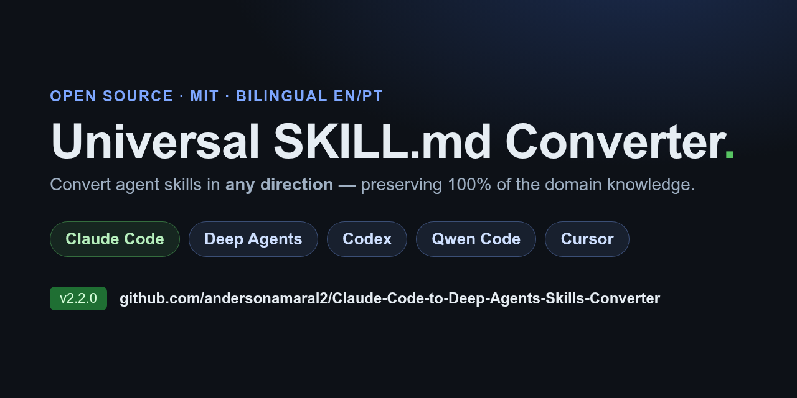

# Universal SKILL.md Converter — Claude Code · Deep Agents · Codex · Qwen Code · Cursor

<p align="center">
  
</p>

[](LICENSE)
[](https://github.com/andersonamaral2/Claude-Code-to-Deep-Agents-Skills-Converter/actions/workflows/lint.yml)
[](https://github.com/andersonamaral2/Claude-Code-to-Deep-Agents-Skills-Converter/releases)
[](https://github.com/andersonamaral2/Claude-Code-to-Deep-Agents-Skills-Converter/commits/main)
[](https://docs.langchain.com/oss/python/deepagents/cli)
[](https://github.com/andersonamaral2/Claude-Code-to-Deep-Agents-Skills-Converter)
[](https://github.com/andersonamaral2/Claude-Code-to-Deep-Agents-Skills-Converter)

Convert **any** SKILL.md between **Claude Code, Deep Agents CLI, Codex CLI, Qwen Code, and Cursor** — preserving 100% of the domain knowledge while adapting each target's execution interface. Every direction is supported, plus dry-run preview and batch processing.

> **Portugues?** [Leia em Portugues](/README.pt.md)
>
> **New here?** The [FAQ](docs/FAQ.md) pre-empts the most common questions (do I even need this, fidelity, per-tool differences).

## Supported formats

| Format | User-level skill dir | Conversion tier |
|--------|----------------------|-----------------|
| **Claude Code** | `~/.claude/skills/<name>/SKILL.md` | — (hub format) |
| **Deep Agents CLI** | `~/.deepagents/agent/skills/<name>/SKILL.md` | Tier B (typed tools) |
| **Codex CLI** | `~/.codex/skills/<name>/SKILL.md` | Tier A (light remap) |
| **Qwen Code** | `~/.qwen/skills/<name>/SKILL.md` | Tier A (light remap) |
| **Cursor** | `~/.cursor/skills/<name>/SKILL.md` | Tier A (light remap) |

All five now use a near-identical natural-language `SKILL.md` format, so conversion to Codex,
Qwen Code, and Cursor is mostly **frontmatter + path + MCP-config remapping** (Tier A). Deep
Agents uses typed explicit tools (`write_file`, `execute`, `task`), so it gets the heavier
**Tier B** translation. The full mapping lives in the
[cross-format reference matrix](/SKILL.en.md#cross-format-reference-matrix) inside the skill.

---

## Why does this exist?

Coding agents increasingly share the same `SKILL.md` idea — a folder with a `SKILL.md` that
teaches the agent a procedure — but they differ in the details that make a skill actually load
and run:

- **Frontmatter rules** differ (Codex forbids `<`/`>` in the description and allows only five
  keys; Qwen uses `allowedTools` in camelCase; Cursor skills use `paths`).
- **File locations** differ (`~/.codex/skills`, `~/.qwen/skills`, `~/.cursor/skills`, …).
- **Memory files** differ (`CLAUDE.md` vs `AGENTS.md` vs `QWEN.md`).
- **Deep Agents** goes further: it uses typed, explicit tools (`write_file`, `execute`,
  `task`), so implicit "create file X" must become "use `write_file` to create X".

A skill authored for one tool won't cleanly load in another until those details are remapped.
This converter handles that translation automatically — **in every direction** — preserving
100% of the domain knowledge.

---

## What's New in v2.2

| Feature | Description |
|---------|-------------|
| 3 new targets | **Codex CLI**, **Qwen Code**, and **Cursor** — all bidirectional |
| Cross-format matrix | One table mapping paths, frontmatter, tools, MCP config across all 5 formats |
| Source/target detection | Infers both ends from fingerprints; picks the right conversion tier |
| Two-tier model | Tier A (light remap for SKILL.md targets) · Tier B (heavy Deep Agents translation) |
| Multi-target validator | `scripts/validate-conversion.sh` enforces each CLI's real frontmatter/path/tool rules |
| `install.sh --target` | Install the converter into any of the 5 CLIs' skill directories |
| Verified vs real CLIs | Formats confirmed against installed Codex 0.98.0 and Qwen Code 0.17.0, not just docs |
| New examples | FastAPI in all 4 formats · Express + JWT + PostgreSQL + Docker · MCP server/tool conversion |
| Hardened CI | Required **gitleaks secret-scan** + **EN/PT parity** checks on every PR |

> Looking for the v2.1 (Claude Code ↔ Deep Agents) feature list? See the [CHANGELOG](CHANGELOG.md).

---

## Installation

### Option A — One-liner (recommended)

No git clone needed — just run:

```bash
curl -fsSL https://raw.githubusercontent.com/andersonamaral2/Claude-Code-to-Deep-Agents-Skills-Converter/main/install.sh | bash
```

That's it. The installer downloads the skill from GitHub, adds proper YAML frontmatter, and registers it in Deep Agents CLI. It auto-detects your locale and picks English or Portuguese.

**With options:**
```bash
# Force Portuguese
curl -fsSL .../install.sh | bash -s -- --lang pt

# Install for a specific agent
curl -fsSL .../install.sh | bash -s -- --agent myagent

# Install the converter skill into another CLI (Deep Agents is the default)
curl -fsSL .../install.sh | bash -s -- --target codex
curl -fsSL .../install.sh | bash -s -- --target cursor
curl -fsSL .../install.sh | bash -s -- --target qwen
curl -fsSL .../install.sh | bash -s -- --target claude
```

`--target` picks the destination skills directory: `~/.deepagents/<agent>/skills`
(default), `~/.claude/skills`, `$CODEX_HOME/skills`, `~/.qwen/skills`, or `~/.cursor/skills`.
For Codex it also runs Codex's bundled validator when available.

### Option B — Clone + install

If you want the full repo (examples, docs, contributing):

```bash
git clone https://github.com/andersonamaral2/Claude-Code-to-Deep-Agents-Skills-Converter.git
cd Claude-Code-to-Deep-Agents-Skills-Converter
./install.sh
```

From the cloned repo you also get:
```bash
./install.sh --agent myagent   # Install for a specific agent
./install.sh --lang pt         # Force Portuguese
./install.sh --uninstall       # Remove the skill
```

### Option C — Let Deep Agents install it for you

Ask the agent itself to fetch and install:

```bash
deepagents -y -S "all" -n "Run: curl -fsSL https://raw.githubusercontent.com/andersonamaral2/Claude-Code-to-Deep-Agents-Skills-Converter/main/install.sh | bash"
```

### Option D — Manual install

If you prefer full control:

```bash
# Global (available in every session)
mkdir -p ~/.deepagents/agent/skills/skill-converter
cp SKILL.en.md ~/.deepagents/agent/skills/skill-converter/SKILL.md

# Or project-scoped
mkdir -p .deepagents/skills/skill-converter
cp SKILL.en.md .deepagents/skills/skill-converter/SKILL.md
```

> **Note:** Manual install skips YAML frontmatter injection. The skill will work but `deepagents skills list` may show a warning. Use the installer for a clean setup.

### Verify installation

```bash
deepagents skills list
# Should show: skill-converter
```

### Uninstall

```bash
# From cloned repo:
./install.sh --uninstall

# Or manually:
rm -rf ~/.deepagents/agent/skills/skill-converter
```

---

## Usage

Once the skill-converter is installed, start Deep Agents and tell it **what to convert** and **where to save**. You provide the source skill in one of two ways:

1. **By file path** — point to a SKILL.md on disk (the agent reads it)
2. **By pasting** — paste the skill content directly into the chat

Every example below assumes the converter is already installed (`deepagents skills list` shows `skill-converter`).

### Method 1 — Convert Claude Code → Deep Agents (from file)

```bash
deepagents -y

> Read the file ~/claude-code-skills/devops-audit/SKILL.md and convert
> this Claude Code skill to Deep Agents. Save as devops-audit-deepagents/SKILL.md
```

### Method 2 — Convert Deep Agents → Claude Code

```bash
deepagents -y

> Convert this Deep Agents skill back to Claude Code format:
> Read ~/deepagents-skills/my-skill/SKILL.md and convert to Claude Code.
> Save as my-skill-claude-code/SKILL.md
```

### Method 2b — Convert Claude Code → Codex (Tier A)

```bash
deepagents -y

> Read ~/.claude/skills/my-skill/SKILL.md and convert it to Codex format.
> Save as ~/.codex/skills/my-skill/SKILL.md
```

The converter keeps the instruction prose, adds Codex-valid frontmatter (hyphen-case `name`,
`description` with no `<`/`>`), and remaps `CLAUDE.md` → `AGENTS.md`. Validate the result with:

```bash
# the converter's own validator
scripts/validate-conversion.sh --target codex ~/.codex/skills/my-skill
# and Codex's bundled validator, if installed
python3 ~/.codex/skills/.system/skill-creator/scripts/quick_validate.py ~/.codex/skills/my-skill
```

### Method 2c — Convert Claude Code → Cursor (Tier A)

```bash
deepagents -y

> Read ~/.claude/skills/my-skill/SKILL.md and convert it to a Cursor skill.
> Save as ~/.cursor/skills/my-skill/SKILL.md
```

Cursor requires the skill `name` to **match its folder name**, drops `allowed-tools`, and
reads `AGENTS.md` for project context. Validate with:

```bash
scripts/validate-conversion.sh --target cursor ~/.cursor/skills/my-skill
```

> **Heads-up:** Cursor also reads `.claude/skills/` natively as a legacy path, so an existing
> Claude Code skill frequently works in Cursor with no conversion at all — converting just
> gives you a clean native layout plus `paths`/`disable-model-invocation`.

### Method 2d — Convert Claude Code → Qwen Code (Tier A)

```bash
deepagents -y

> Read ~/.claude/skills/my-skill/SKILL.md and convert it to a Qwen Code skill.
> Save as ~/.qwen/skills/my-skill/SKILL.md
```

The key step is the **tool-name remap**: Claude `allowed-tools: Read, Write, Edit, Bash`
becomes Qwen `allowedTools: [read_file, write_file, edit, run_shell_command]` (snake_case YAML
list). `CLAUDE.md` → `QWEN.md`. Validate with:

```bash
scripts/validate-conversion.sh --target qwen ~/.qwen/skills/my-skill
```

### Method 3 — Dry-run / Preview (no save)

```bash
deepagents -y

> Preview the conversion of ~/my-skill/SKILL.md from Claude Code to Deep Agents.
> Don't save yet, just show me the diff.
```

### Method 4 — Batch conversion

```bash
deepagents -y

> Convert all Claude Code skills in ~/claude-skills/ to Deep Agents format.
> Save each one in ~/deepagents-skills/{name}/SKILL.md
```

### Method 5 — Convert and register directly

```bash
deepagents -y

> Read ~/my-claude-code-skill/SKILL.md, convert from Claude Code to Deep Agents,
> and save directly to ~/.deepagents/agent/skills/my-skill/SKILL.md
```

### Method 6 — Non-interactive (one-shot)

```bash
deepagents -n -y \
  "Read the file ./SKILL-claude-code.md and convert from Claude Code to Deep Agents. \
   Save as ./SKILL-deepagents.md"
```

### Method 7 — Paste the skill directly

No file needed — just paste the content into the chat:

```bash
deepagents -y

> Convert this Claude Code skill to Deep Agents and save as ./converted/SKILL.md:
>
> # Skill: My App
> Create the file src/main.py:
> ...
```

---

## What the conversion does

The skill applies **8 mandatory transformations** (T1-T8):

| # | Transformation | What it adds |
|---|----------------|--------------|
| T1 | Execution context header | Table mapping Deep Agents tools to skill usage (only used tools) |
| T2 | Execution plan | Checklist for `write_todos` with all steps |
| T3 | Prerequisites | External tool + env var verification via `execute` |
| T4 | Explicit creation | Every "create the file" becomes explicit `write_file` |
| T5 | Inline tests | After each file created, test via `execute` |
| T6 | Sub-agents | Multi-item flows converted to parallel `task` calls |
| T7 | Usage guide | 3 usage modes (interactive, one-shot, CI/CD) |
| T8 | Troubleshooting | Common issues based on dependencies |

Plus handles these **additional patterns**:

| Pattern | Conversion |
|---------|------------|
| Inline commands (`run \`npm install\``) | Extracted to explicit `execute` blocks |
| Environment variables / secrets | Verification script + `.env` support |
| Conditional / platform-specific | Shell `case`/`if` blocks via `execute` |
| Claude Code Agent tool | `task` sub-agents |
| Claude Code hooks (settings.json) | Shell scripts + AGENTS.md documentation |
| Extended thinking | Model-dependent pass-through |
| MCP custom tools (`mcp__*`) | Same tools, config path `.deepagents/mcp.json` |
| YAML frontmatter | Added with skill metadata and version compat |

And performs automatic **semantic replacements**:

| Claude Code | Deep Agents |
|-------------|-------------|
| `CLAUDE.md` | `AGENTS.md` |
| `.claude/` | `.deepagents/` |
| Implicit bash | Explicit `execute` |
| Implicit writing | Explicit `write_file` |
| Implicit editing | Explicit `edit_file` |
| Implicit reading | Explicit `read_file` |
| curl via bash | `http_request` or `execute` |
| Sequential loop | `task` for sub-agents |
| Agent tool | `task` tool |

---

## Real example: before and after

### Before (Claude Code)

```markdown
# Skill: REST API Generator

Create the file `src/app.py`:

```python
from flask import Flask
app = Flask(__name__)
```

Install the dependencies:

```bash
pip install flask
```

Test:

```bash
python src/app.py
```
```

### After (Deep Agents)

```markdown
---
name: rest-api-generator
description: "Generates a Flask REST API with basic setup"
metadata:
  converted-from: claude-code
  converter-version: "2.0"
  deep-agents-compat: ">=0.0.34"
---

# Skill: REST API Generator

## Execution Context
| Tool | Usage in this skill |
|------|---------------------|
| `write_file` | Create Flask project files |
| `execute` | Install dependencies and run tests |

## Execution Plan (use with `write_todos`)
- [ ] 1. Check Python 3.11+
- [ ] 2. Create directory structure
- [ ] 3. Create src/app.py
- [ ] 4. Install dependencies
- [ ] 5. Test

## Prerequisites Check
Use `execute`:
```bash
python3 --version
```

Use `write_file` to create `src/app.py`:
```python
from flask import Flask
app = Flask(__name__)
```

Test via `execute`:
```bash
python -c "from src.app import app; print('OK')"
```

Install dependencies via `execute`:
```bash
pip install flask
```

Full test via `execute`:
```bash
python src/app.py &
curl http://localhost:5000
kill %1
```
```

See the `examples/` directory for **complete before/after conversions** showing all 8 transformations applied:

- **FastAPI Todo App** (`claude-code-sample` → `deep-agents-output`) — also converted to Codex, Cursor, and Qwen formats (`codex-output`, `cursor-output`, `qwen-output`).
- **Docker Monitoring Stack** (`claude-code-sample-2` → `deep-agents-output-2`).
- **Express.js JWT API with PostgreSQL + Docker** (`claude-code-sample-3` → `deep-agents-output-3`) — a real-world conversion with JWT auth, layered middleware, a relational database, and containerized local dev.

---

## Repository structure

```
Claude-Code-to-Deep-Agents-Skills-Converter/
  ├── README.md              <- You are here (English)
  ├── README.pt.md           <- Portugues
  ├── SKILL.en.md            <- Skill definition (English)
  ├── SKILL.pt.md            <- Skill definition (Portugues)
  ├── install.sh             <- One-command installer
  ├── examples/
  │   ├── claude-code-sample/        <- Input: Claude Code skill
  │   ├── deep-agents-output/        <- Output: converted with all T1-T8
  │   ├── claude-code-sample-2/      <- Input: another Claude Code skill
  │   └── deep-agents-output-2/      <- Output: converted with all T1-T8
  ├── CHANGELOG.md
  ├── CONTRIBUTING.md
  ├── CODE_OF_CONDUCT.md
  └── LICENSE (MIT)
```

After installation, the skill lives at:

```
~/.deepagents/
  └── agent/
      └── skills/
          └── skill-converter/
              └── SKILL.md
```

---

## Tips

**Use `-y` during conversion.** The converter performs multiple `read_file` and `write_file` operations — auto-approve prevents stopping at each one.

**Recommended models.** Models with large context windows (128k+) work best because the original skill + conversion rules + output take up significant space. Kimi K2.5, Claude Sonnet/Opus, and GPT-4o are good choices.

**Automated validation.** After converting, the skill runs a grep-based validation script that checks for missing sections, unconverted patterns, and stale references. No more manual checking.

**Very large skills (>500 lines).** If the original skill is huge, consider asking the converter to split it into sub-skills. Deep Agents supports multiple SKILL.md files in the same skill folder.

**Batch processing.** Convert an entire directory of skills at once. Each conversion runs in a parallel sub-agent for speed.

---

## Limitations

- The converter does not execute the skill — it only adapts the document so that Deep Agents CLI can execute it.
- Skills that depend on features exclusive to Claude Code's sandbox (such as access to specific network ports) may need manual adjustments in the local environment.
- Conversion quality depends on the LLM model running the Deep Agents CLI.
- Reverse conversion (Deep Agents → Claude Code) removes explicit tool references, which may lose some precision in edge cases.

---

## Compatibility

- **Deep Agents CLI**: v0.0.34+ (tested)
- **Python**: 3.11+ (Deep Agents requirement)
- **Skill format**: YAML frontmatter with `name`, `description`, `metadata` fields

---

## License

MIT — use, adapt, and distribute as you wish. See [LICENSE](LICENSE).

---

## 🚨 Scoras Digital DevOps Agent — Verificação

[-red?style=for-the-badge&logo=github)](./andersonamaral2_Claude-Code-to-Deep-Agents-Skills-Converter_2026-08-05.md)
[](https://github.com/andersonamaral2/Claude-Code-to-Deep-Agents-Skills-Converter)

| Campo | Valor |
|-------|-------|
| 🤖 Avaliado por | Scoras Digital DevOps Agent |
| 📅 Data da Avaliação | `05/08/2026` |
| 📊 Score DevOps & Segurança | `28/100` |
| 🎯 Nota | F — Crítico |
| 📄 Relatório Completo | [andersonamaral2_Claude-Code-to-Deep-Agents-Skills-Converter_2026-08-05.md](./andersonamaral2_Claude-Code-to-Deep-Agents-Skills-Converter_2026-08-05.md) |

> *Este repositório foi auditado automaticamente pelo **Scoras Digital DevOps Agent**,*  
> *verificando métricas DORA, CI/CD, segurança (CVEs, secrets, SAST) e boas práticas.*  
> *Última avaliação: **05/08/2026***

---

