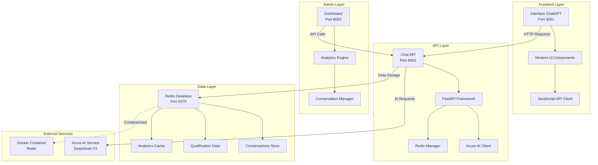

# 🏗️ Arquitetura do Sistema - Scoras Academy Agent

## 📊 Visão Geral da Arquitetura



## 🔧 Componentes Principais

### 1. **Frontend Interface (Port 3001)**

#### 📱 Tecnologias
- **HTML5**: Estrutura semântica moderna
- **CSS3**: Design responsivo com CSS Variables
- **JavaScript ES6+**: Lógica interativa e comunicação API
- **Font Awesome**: Ícones modernos
- **Inter Font**: Tipografia profissional

#### 🎨 Características
- **Design ChatGPT-style**: Interface moderna e intuitiva
- **Responsivo**: Funciona em desktop, tablet e mobile
- **Animações**: Transições suaves e indicadores visuais
- **Real-time**: Status de conexão e typing indicators
- **Acessibilidade**: Suporte a screen readers e navegação por teclado

### 2. **Chat API (Port 8003)**

#### ⚙️ Tecnologias
- **FastAPI**: Framework Python moderno e rápido
- **Azure AI Inference**: Cliente oficial Azure
- **Redis-py**: Cliente Redis para Python
- **Uvicorn**: Servidor ASGI de alta performance
- **Pydantic**: Validação de dados e serialização

#### 🤖 Funcionalidades
- **Chat Inteligente**: Processamento via Azure AI (DeepSeek-V3)
- **Qualificação de Leads**: Detecção automática de dados de contato
- **Persistência**: Armazenamento completo no Redis
- **Health Monitoring**: Endpoints de monitoramento
- **Rate Limiting**: Controle de tráfego

### 3. **Admin Dashboard (Port 8002)**

#### 📊 Tecnologias
- **FastAPI**: Backend para dashboard
- **HTML/CSS/JS**: Interface administrativa
- **Redis Analytics**: Métricas em tempo real

#### 📈 Funcionalidades
- **Analytics em Tempo Real**: Estatísticas de conversas
- **Gestão de Leads**: Visualização de leads qualificados
- **Histórico Completo**: Navegação por conversas
- **Auto-refresh**: Atualização automática

### 4. **Redis Database (Port 6379)**

#### 🗄️ Estrutura de Dados
```redis
# Conversas
conversation:{user_id}
{
  "user_id": "string",
  "created_at": "ISO datetime",
  "lead_type": "academy",
  "messages": [
    {
      "timestamp": "ISO datetime",
      "user_message": "string",
      "bot_response": "string"
    }
  ]
}

# Qualificação
qualification:{user_id}
{
  "nome": "string|null",
  "email": "string|null", 
  "telefone": "string|null",
  "interesse": "string|null",
  "lead_type": "academy",
  "qualified": boolean,
  "last_interaction": "ISO datetime"
}
```

## 🔄 Fluxo de Dados

### 1. **Fluxo de Conversa**
```
1. User Input → Frontend
2. Frontend → Chat API (POST /chat-simple)
3. Chat API → Azure AI Service
4. Azure AI → Response
5. Chat API → Redis Storage
6. Chat API → Frontend Response
7. Frontend → UI Update
```

### 2. **Fluxo de Analytics**
```
1. Dashboard → Chat API (GET /admin/analytics)
2. Chat API → Redis Query
3. Redis → Aggregated Data
4. Chat API → Dashboard Response
5. Dashboard → UI Update
```

---

<div align="center">

**🎓 Arquitetura Scoras Academy Agent v2.1.0**

*Projetado para performance, escalabilidade e manutenibilidade*

</div> 